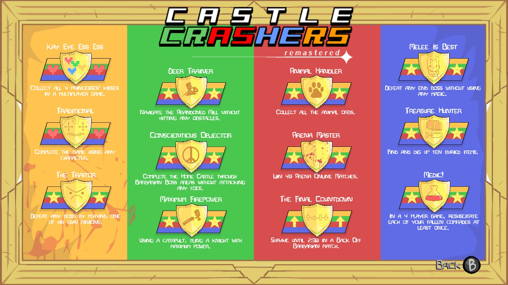

# Achievements/Trophies

[My trophy guide on PSNProfiles](https://psnprofiles.com/guide/5971-castle-crashers-trophy-guide) - Published 30 Jan 2020

- Playstation 3, 13 Trophies. 9 bronze, 3 silver, 1 gold
- Playstation 4/5, 13 Trophies. 2 silver, 10 gold, 1 platinum
- Steam, 12 Achievements
- Xbox, 12 Achievements worth 200G
- Xbox One, 12 Achievements worth 1000G
- Nintendo Switch, 12 in-game achievements

16 unique achievements/trophies, total 74.

****

Screenshot of all achievements on Nintendo Switch:

## 🏆 Animal Handler

> Collect all the animal orbs.

Original CC on Xbox description:

> Collect all the **animals**.

## 🏆 Arena Master

> Win 40 Arena Online Matches.

Original CC description:

> Win 40 Arena **Ranked** Matches.

## 🏆 Conscientious Objector

> Complete the Home Castle through Barbarian Boss areas without attacking any foes.

Original CC on Playstation 3 description:

> Complete the Home Castle through **the** Barbarian Boss areas without attacking any foes.

## 🏆 Deer Trainer

> Navigate the Abandoned Mill without hitting any obstacles.

## 🏆 Glork

> Win 20 All You Can Quaff Ranked Matches.

**Original CC on Xbox only**

## 🏆 Kay Eye Ess Ess

> Collect all 4 princesses' kisses in a multiplayer game.

## 🏆 Maximum Firepower

> Using a catapult, fling a knight with maximum power.

## 🏆 Medic!

> In a 4 player game, resuscitate each of your fallen comrades at least once.

## 🏆 Melee Is Best

> Defeat any boss without using any magic.

CC Remastered description:

> Defeat any **end** boss without using any magic.

## 🏆 Social Networker

> Reach 20 hits in a single Volleyball rally.

**Original CC on Playstation 3 only**

## 🏆 The Final Countdown

> Survive until 2:30 in a Back Off Barbarian match.

**CC Remastered only**

## 🏆 The Traitor

> Defeat any boss by playing one of his own minions.

## 🏆 Traditional

> Complete the game using any character.

## 🏆 Treasure Hunter

> Find and dig up ten buried items.

Original CC on Playstation 3 description:

> Find and dig up **10** buried items.

## 🏆 Trophy Crasher

> Earn all Trophies

**CC Remastered on Playstation 4/5 only**

## 🏆 You Are Insane

> Complete Insane mode and become the ultimate Castle Crasher.

**Original CC on Playstation 3 only**
